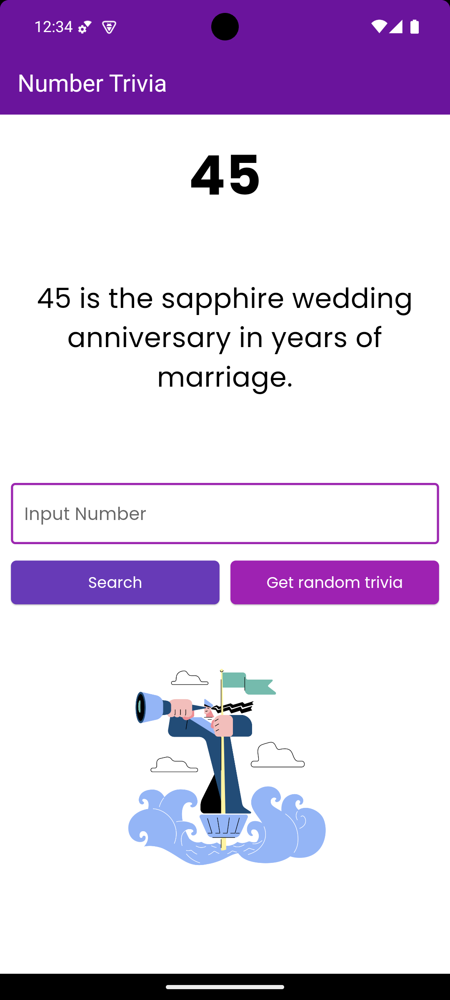

# TDD Clean Architecture for Flutter

<p align="center">
  
</p>
<p align="center">
  <h3 align="center">Number Trivia App</h3>
  <p align="center">
    Number Trivia App using clean architecture and test-driven development
    <br>
    Project inspired by Reso Coder's <a href="https://resocoder.com/category/tutorials/flutter/tdd-clean-architecture/">Clean Architecture TDD Course</a>.
    <br>
  </p>
</p>

## What's Included

- :star: **State Management** using the BLoC pattern
- :star: **Test-Driven Development** with unit tests for domain and data layers using `mocktail`
- :star: **Dependency Injection** using `get_it`
- :star: **Functional Programming** with `dartz` package
- :star: **Equality Checks** in classes using `equatable`
- :star: **REST API** integration with `http`
- :star: **Exception Handling** using custom Failure classes
- :star: **Persistent Data** using shared preferences
- :star: **Null Safety** support for safer, more reliable code

## Project Architecture

This project follows the principles of **Clean Architecture**. The code is split into the following layers:

- **Domain Layer**: Contains core business logic and use cases.
- **Data Layer**: Handles data from APIs, local databases, or any external sources.
- **Presentation Layer**: Manages the user interface (UI) using BLoC for state management.

### Clean Architecture Diagrams

- **Reso Coder's Clean Architecture Diagram**  
  

- **Robert C. Martin's Clean Architecture Diagram**  
  

By using this structure, it's easier to test, modify, and extend the application, especially in large-scale projects.

## Key Features

### 1. **Bloc State Management**
Bloc (Business Logic Component) is used for managing states across the app. This makes the app's business logic independent of the UI.

### 2. **Dependency Injection**
The `get_it` package is used for easy dependency injection, making it simple to switch implementations or mock objects for testing.

### 3. **Functional Programming with Dartz**
The `dartz` package enables functional programming patterns, such as using `Either` for handling failures and successes, ensuring clean and maintainable code.

### 4. **API Integration**
The app uses the `http` package for fetching data from a REST API. It retrieves [describe the data, e.g., trivia, user information].

### 5. **Error Handling**
Custom `Failure` classes handle exceptions gracefully, ensuring a smooth user experience when errors occur.

### 6. **Null Safety**
This project is built with Dart's **Null Safety** features enabled, ensuring fewer runtime errors and safer code by handling null values properly.

## Testing

This project follows **Test-Driven Development (TDD)** practices. Unit tests are provided for the domain, data, and presentation layers. To run the tests, use:

```bash
flutter test
```

We use the `mocktail` package for mocking dependencies in the tests. This ensures clean and isolated testing of components by mocking external dependencies such as services and repositories.

## How to Contribute

Feel free to contribute to this project. You can do so by:

1. Forking the repository.
2. Creating a feature branch (`git checkout -b feature/your-feature`).
3. Committing your changes (`git commit -m 'Add some feature'`).
4. Pushing to the branch (`git push origin feature/your-feature`).
5. Opening a pull request.

---

### License

This project is licensed under the MIT License. See the [LICENSE](LICENSE) file for details.

---

**_More tutorials and information on Flutter development can be found on [Reso Coder](https://resocoder.com)._**

---

This updated README includes information about:

- The use of `mocktail` for testing.
- Support for **Null Safety**, highlighting that the project uses Dart’s safety features to avoid null reference errors. 

If you'd like to add more details, like specific features or screenshots, feel free to reach out!